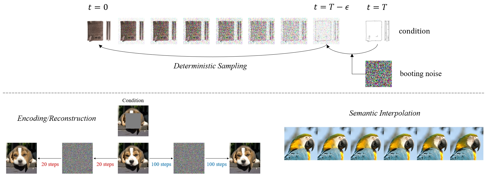

# Diffusion Bridge Implicit Models

Official Implementation of [Diffusion Bridge Implicit Models](https://arxiv.org/abs/2405.15885). 

<p align="center">
  
</p>

DBIM provides offers a suite of fast samplers tailored for [Denoising Diffusion Bridge Models (DDBMs)](https://arxiv.org/abs/2309.16948). We clean the codebase to support a broad range of diffusion bridges, facilitating unified training and sampling workflows. We also streamline the deployment process by replacing the cumbersome MPI-based distributed launcher with the more efficient and engineer-friendly `torchrun`.


# Dependencies

To install all packages in this codebase along with their dependencies, run
```sh
pip install torch torchvision --index-url https://download.pytorch.org/whl/cu121
pip install blobfile piq matplotlib opencv-python joblib lmdb scipy clean-fid easydict torchmetrics rich ipdb
```

# Pre-trained models

Please put the downloaded checkpoints under `assets/ckpts/`.

For image translation, we directly adopt the pretrained checkpoints from [DDBM](https://github.com/alexzhou907/DDBM):

- Edges2Handbags: [e2h_ema_0.9999_420000.pt](https://huggingface.co/alexzhou907/DDBM/resolve/main/e2h_ema_0.9999_420000.pt)
- DIODE: [diode_ema_0.9999_440000.pt](https://huggingface.co/alexzhou907/DDBM/resolve/main/diode_ema_0.9999_440000.pt)

We remove the dependency on external packages such as `flash_attn` in this codebase, which is already supported natively by PyTorch. After downloading the two checkpoints above, please run `python preprocess_ckpt.py` to complete the conversion.

For image restoration:

- Center 128x128 Inpainting on ImageNet 256x256: [imagenet256_inpaint_ema_0.9999_400000.pt](https://drive.google.com/file/d/1WozJyVOAFukj0nUYLS-ZUp1-QHuGNfox)

# Datasets

Please put (or link) the datasets under `assets/datasets/`.

- For Edges2Handbags, please follow instructions from [here](https://github.com/junyanz/pytorch-CycleGAN-and-pix2pix/blob/master/docs/datasets.md). The resulting folder structure should be `assets/datasets/edges2handbags/train` and `assets/datasets/edges2handbags/val`.
- For DIODE, please download the training dataset and the data list from [here](https://diode-dataset.org/). The resulting folder structure should be `assets/datasets/DIODE/train` and `assets/datasets/DIODE/data_list`.
- For ImageNet, please download the dataset from [here](https://image-net.org/download.php). The resulting folder structure should be `assets/datasets/ImageNet/train` and `assets/datasets/ImageNet/val`.

We also provide automatic downloading scripts.
```
cd assets/datasets
bash download_extract_edges2handbags.sh
bash download_extract_DIODE.sh
bash download_extract_ImageNet.sh
```

After downloading, the DIODE dataset requires preprocessing by running `python preprocess_depth.py`.

# Sampling

```
bash scripts/sample.sh $DATASET_NAME $NFE $SAMPLER ($AUX)
```

- `$DATASET_NAME` can be chosen from `e2h`/`diode`/`imagenet_inpaint_center`.
- `$NFE` is the *Number of Function Evaluations*, which is proportional to the sampling time.
- `$SAMPLER` can be chosen from `heun`/`dbim`/`dbim_high_order`. 
  - `heun` is the vanilla sampler of DDBM, which simulates the SDE/ODE step alternatively. In this case, `$AUX` is not required.
  - `dbim` and `dbim_high_order` are our proposed samplers. When using `dbim`, `$AUX` corresponds to $\eta$ which controls the stochasticity level (floating-point value in $[0,1]$). When using `dbim_high_order`, `$AUX` corresponds to the order (2 or 3).

The samples will be saved to `workdir/`.

# Evaluations

Before evaluating the image translation results, please download the reference statistics from DDBM and put them under `assets/stats/`:
- Reference stats for Edge2Handbags: [edges2handbags_ref_64_data.npz](https://huggingface.co/alexzhou907/DDBM/resolve/main/edges2handbags_ref_64_data.npz).
- Reference stats for DIODE: [diode_ref_256_data.npz](https://huggingface.co/alexzhou907/DDBM/resolve/main/diode_ref_256_data.npz).

The evaluation can automatically proceed by specifying the same dataset and sampler arguments as sampling:

```
bash scripts/evaluate.sh $DATASET_NAME $NFE $SAMPLER ($AUX)
```